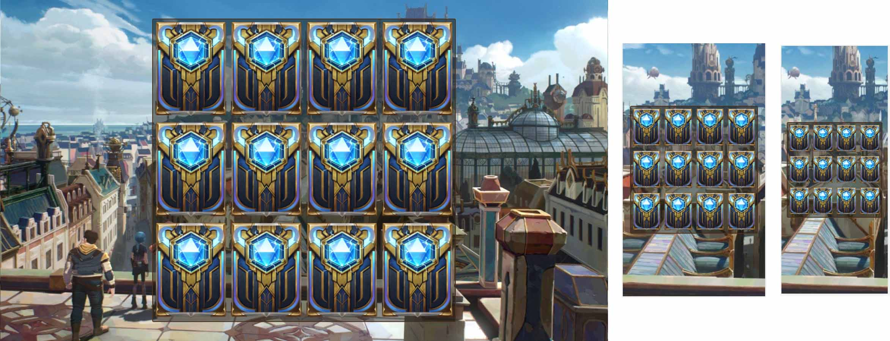

# Title

## Sobre

Desafio de projeto DIO: jogo da memória.

## Decisões

Por se tratar de um desafio de projeto, gosto de explicar certas decisões:

Criei a página como responsiva, então, teoricamente, deveria funcionar em telas de qualquer tamanho:

1. Uso de max-width e max-height + width e height com tamanhos relativos em vw. Usando vw em ambos garanto que os dois terão a proporção que eu quiser e sempre irão se ajustar ao tamanho das telas onde estão sendo vistos.

Criar os cards via js ao invés de fazer direto no html.

1. Acho repetitivo e trabalhoso ficar criando as cartas diretamente no html. Então só deixei um template lá e o usei como base para gerar as cartas.
2. Outro retrabalho que existe é ter que ficar sempre criando uma copia da mesma carta, afinal, são duas iguais que precisamos ter.
3. Criei um objeto cardsData que é uma array carrega os dados de cada carta. Então se quiser mudar algo, adicionar algo, é só mudar lá que já produz efeitos no html.

Para guardar e retornar os estados do jogo, criei um gameState. Acho que deixar esses estados "livres" no script deixa o código um pouco sujo. Então prefiri separar os estados daqueles que os usa. Assim fica mais fácil de entender o que está acontecendo, e depois se quiser, saber como está acontecendo.

1. Criei uma função clearAll dentro dele, para evitar ter que criar algo similar fora dele. Acho que que um gameState.clearAll deixa semanticamente claro o que está acontecendo.
2. A função de comparação serve para que qualquer um que queira fazer essa comparação nao tenha que escrever tudo aquilo toda vez.
